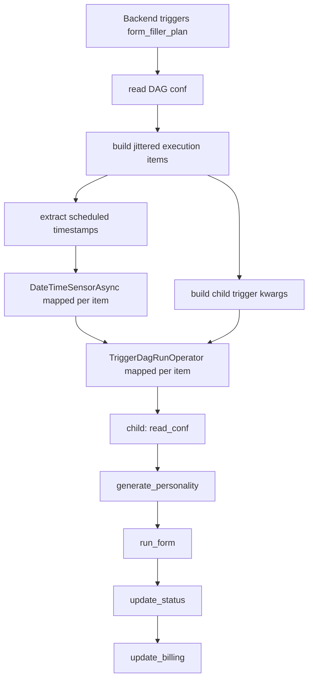

# Airflow and form automation

## DAG topology



### Parent: `form_filler_plan`

The parent reads `form_url`, execution count, base interval, jitter, user id,
and its own Airflow run id. It creates mapped schedule/trigger tasks. Each child
id is `<parent-run-id>__item_<index>` and receives the parent run id in `conf`.

The asynchronous date sensor lets the triggerer wait without occupying a
scheduler worker.

### Child: `form_filler_dag`

One child corresponds to one form submission:

1. Read child configuration.
2. Query the parent trigger row and build a randomized personality.
3. Launch Chromium and visit the form.
4. For each page, extract/deduplicate questions.
5. Read cached answers or call OpenAI.
6. Fill each recognized control with human-like pauses.
7. Click next/submit until complete.
8. Store questions/answers and aggregate progress.
9. Deduct one quota unit after success.

Airflow uses `LocalExecutor`, so task processes run in the scheduler container.
Xvfb provides a display for headed Chromium.

## Normalized question contract

Extractors produce objects shaped like:

```json
{
  "id": 1,
  "question": "How satisfied are you?",
  "type": "multiple_choice",
  "options": ["Very", "Somewhat", "Not" ]
}
```

The OpenAI response schema requires the same fields plus `ANSWERS`. Fillers
read `answer["ANSWERS"]` and expect a string, list, or row/column mapping based
on the question type.

## Supported controls

| Platform | Detected/extracted/fillable controls |
| --- | --- |
| Google Forms | Multiple choice, checkbox, dropdown, short text, paragraph, date, time, radio matrix, checkbox matrix |
| Microsoft Forms | Text, paragraph, radio choice, checkbox choice, dropdown, star rating, linear scale, NPS, date, Likert, ranking |

Selectors are DOM-implementation-specific. A provider markup change can break
detection, extraction, navigation, or filling independently.

## Browser behavior

`launch_browser()` selects a random user agent, viewport, timezone, and locale,
runs headed Chromium, and injects scripts that mask common Playwright signals.
Human helpers add randomized scrolling, mouse movement, typing delay, and
pauses. Browser lifetime spans all pages of one form execution.

## LLM integration

The active DAG path uses `chatgptFormFiller` with `gpt-4.1-mini`, temperature
zero, and a JSON schema response format. The prompt contains normalized form
data and the generated personality.

`geminiFormFiller` exists as an alternative implementation of the abstract
chat interface, but the DAG does not select it. Gemini errors currently return
an empty object, whereas OpenAI errors raise.

## Personality generation

Five UI axes are persisted with the trigger row. `PersonalityBuilder` loads
`PERSONAS.json`, chooses two or three traits per selected axis, and adds random
hobby/communication/backstory variations. This makes repeated executions
non-deterministic even with identical selections.

## Answer caching

`get_or_create_page_answers()` caches the first generated answers by form URL
and page index. A hit skips the LLM call. The current key omits personality and
question content; consequently different users or personalities can reuse the
same answers. This is documented as a high-priority design issue.

## Failure semantics

The child `run_form` task does not catch browser/LLM exceptions into its
declared result structure. If it raises, downstream status and billing tasks
normally do not run, so `hasFailedRuns` may remain false and the application
can continue to show the parent as queued. Airflow task state remains the most
accurate low-level diagnostic source.
