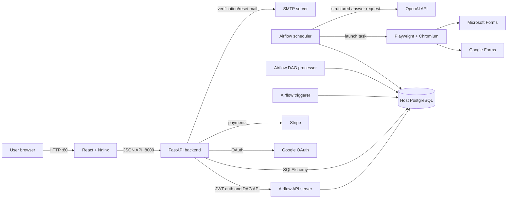

# System architecture

## Context

Former is a browser-based control plane for an asynchronous form-submission
pipeline. The user-facing request is synchronous only until Airflow accepts a
DAG run. Browser work happens later in child DAG runs.

## Local runtime topology

Docker Compose runs six long-lived containers plus one one-shot initializer:

| Service | Responsibility | Exposed port |
| --- | --- | --- |
| `frontend` | Builds React and serves static assets through Nginx | `80` |
| `backend` | FastAPI application and application-table initialization | `8000` |
| `airflow-api-server` | Airflow UI, REST API, and task execution API | `9090 -> 8080` |
| `airflow-scheduler` | Schedules DAG tasks using `LocalExecutor` | none |
| `airflow-dag-processor` | Parses and serializes DAG files | none |
| `airflow-triggerer` | Runs deferred triggers such as `DateTimeSensorAsync` | none |
| `airflow-init` | Applies Airflow metadata migrations, then exits successfully | none |

PostgreSQL is intentionally not a Compose service. Containers connect to the
PostgreSQL 17 instance on the host through `host.docker.internal:5432`.

## Component boundaries

### React frontend

Owns presentation, browser routing, session token persistence, optimistic run
updates, and Stripe Elements. It does not connect directly to Airflow or the
database.

### FastAPI backend

Acts as the trust boundary. It validates JWTs, scopes runs and billing records
to the current user, handles OAuth/email/password flows, calls Airflow, and
records application state.

### Airflow

Owns deferred scheduling and execution. The parent DAG calculates individual
execution times. Each child DAG owns one browser submission and updates
application progress and quota after completion.

### Form automation and LLM layer

Playwright adapters identify Google/Microsoft form controls, normalize them
into question dictionaries, obtain structured answers from an LLM, and
dispatch answers to platform-specific fillers.

### PostgreSQL

Is both the application system of record and the Airflow metadata store. This
simplifies local operation but increases coupling: application and Airflow
schema migrations, backups, connection limits, and outages share one database.

## Configuration boundary

Application code reads canonical names only:

- `APP_ENV`: `local`, `production`, or `test`
- `DATABASE_URL` and optional `AIRFLOW_DB_URI`
- `AIRFLOW_HOST`, `AIRFLOW_BASE_URL`, credentials, and DAG id
- `FRONTEND_URL`
- OAuth, JWT, Stripe, LLM, SMTP, and expiry settings

Local values come from `.env` and Compose explicitly sets `APP_ENV=local`.
Production uses deployment-managed settings matching
`.env.production.example`. Legacy `LOCAL_*`, `ENV`, and `AIRFLOW_MODE` names
are not part of the runtime contract.

## Deployment shape

Local development uses multiple containers because Airflow 3 separates API,
scheduler, parsing, and trigger processing. The Airflow image includes the
DAGs, Python package, Playwright, Chromium, and Xvfb.

`app.yaml` describes the current production-oriented Azure container app. It
co-locates frontend, backend, Airflow, and PostgreSQL containers and relies on
container-local `localhost` addressing. See [Risks and roadmap](risks-and-roadmap.md)
before treating this as a production reference architecture.
