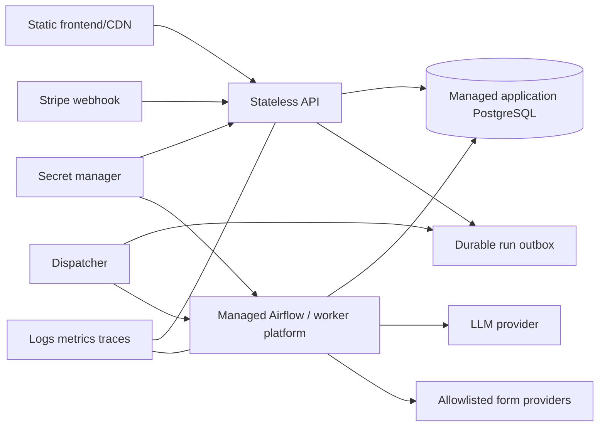

# Risks and roadmap

This page separates observed implementation risks from the target design. The
priorities are recommendations, not evidence that an item is already scheduled.

## P0 — security and financial integrity

### Rotate and remove committed/deployment plaintext secrets

`app.yaml` contains production-style credentials and API keys as plain values.
Rotate exposed credentials, move them to the deployment secret store, and keep
only secret references in manifests. Retire `merge_env_to_appyaml.py`, which
copies local `.env` values into YAML.

### Do not trust client-submitted transactions

`POST /billing/transaction` accepts amount, status, and purchased fills from an
authenticated client and credits quota when status is `succeeded`. Remove or
restrict it. Credit accounts only after server-side Stripe verification or a
signed Stripe webhook with idempotency.

### Enforce quota atomically before scheduling

The UI checks balance, but `/airflow/trigger` does not. Concurrent or direct
API requests can schedule more fills than available. Reserve the complete
requested count in a locked database transaction before calling Airflow, then
settle/refund reservations from child outcomes.

### Restrict form destinations

The API accepts a general `HttpUrl`, while automation only supports Google and
Microsoft Forms. Validate an explicit hostname allowlist before Airflow or
Playwright sees the URL. This reduces SSRF/internal-network browsing risk and
produces a useful client error for unsupported forms.

### Harden authentication transport and token storage

OAuth cookies use `secure=False`; production should use Secure, HttpOnly,
appropriate SameSite settings, trusted proxy configuration, and HTTPS. The
frontend stores bearer and refresh tokens in `sessionStorage`, exposing them to
successful XSS. Prefer a consistent server-managed cookie/session design.

## P1 — correctness and durability

### Redesign answer caching

The cache key `(form_url, page_index)` ignores question content, personality,
user, and form revisions. It can return another user's/personality's answers.
At minimum key by normalized-question hash and personality hash; decide whether
cross-user caching is permissible at all.

### Record failed child executions reliably

Browser or LLM exceptions prevent `update_status` from running. Wrap execution
with cleanup/error capture, use an Airflow failure callback or trigger rule,
and persist a failed `FormRunAnswers`/progress update for every terminal child.

### Introduce application migrations

`create_all()` creates missing tables but does not evolve existing schemas.
Add versioned Alembic migrations, run them as a dedicated deployment step, and
remove schema mutation from web-process startup.

### Make production PostgreSQL durable

The current production YAML shows PostgreSQL as a sidecar without declared
persistent storage. Use a managed PostgreSQL service or explicitly durable,
backed-up storage. Do not scale multiple app replicas around a container-local
database.

### Make cross-system trigger creation recoverable

Airflow is called before the trigger audit row is committed. Use an outbox/job
record first, idempotent dispatch, and reconciliation so accepted DAGs are not
orphaned when the application database write fails.

### Fix frontend/backend request mismatch

The frontend sends `{current_password, new_password}` but the backend schema
expects `{old_password, new_password}`. Align the contract and add an API test.

## P2 — maintainability and operability

### Pin and split dependencies

`requirements.txt` is unpinned and shared by backend and Airflow. This installs
Airflow/Playwright into the backend and risks version drift from the Airflow
base image. Create locked backend, Airflow, migration, and development sets.
Add the missing `pandas` dependency or remove it from `PersonalityBuilder`.

### Repair and modernize tests

Current collection includes:

- missing `pandas` for e2e imports;
- stale `AUTH_USERS_FILE` import;
- stale `former.backend.dagOperations` import;
- API tests that patch dependencies in ways no longer compatible with FastAPI;
- live browser tests mixed with unit tests.

Split unit/integration/e2e suites, use FastAPI dependency overrides, provision
an isolated test database, and run them in CI.

### Consolidate duplicate UI code

`RunsTable.jsx` and `RunResult.jsx` contain near-identical run table/modal
implementations. Keep one. Several standalone components are unused or partly
superseded.

### Centralize frontend auth state

Every `useAuth()` invocation owns separate state and may fetch `/auth/me`.
Introduce an auth context/provider to remove duplicate requests and keep the
chosen session lifetime centralized.

### Add run polling or push updates

Run state is fetched once. Add bounded polling, Server-Sent Events, or WebSocket
updates with backoff so progress changes without a page refresh.

### Add readiness, metrics, and structured logs

Define container healthchecks, database/Airflow readiness, structured logging,
request correlation with run ids, task metrics, and alerts. Redact raw LLM
responses, form content, tokens, and personal data from logs.

### Reduce direct Airflow metadata coupling

Cancellation queries `dag_run` directly. Prefer supported Airflow APIs or an
application-owned parent/child mapping so Airflow schema changes do not break
the backend.

## P3 — quality improvements

- Normalize class/function naming (`ChatInterface`, `ChatGPTFormFiller`) and fix
  prompt/variable typos.
- Replace broad exception handlers and `print()` diagnostics with typed errors
  and structured logs.
- Close SQLAlchemy sessions in `generate_personality` on all paths.
- Guarantee browser/context/session cleanup with `try/finally` in the DAG.
- Validate LLM answer count/type against extracted questions before filling.
- Detect unsupported question types and fail visibly instead of silently
  skipping them.
- Reconcile initial quotas: model default 10, password registration 20, OAuth
  registration 10.
- Remove unused parent-DAG helper tasks and misleading descriptions.
- Replace deprecated SQLAlchemy/FastAPI APIs and address mojibake in source/logs.

## Suggested target architecture

The key changes are durable managed storage, explicit secret management,
atomic quota/outbox handling, allowlisted browser targets, webhook-based
payments, and independently scalable API/worker boundaries.
