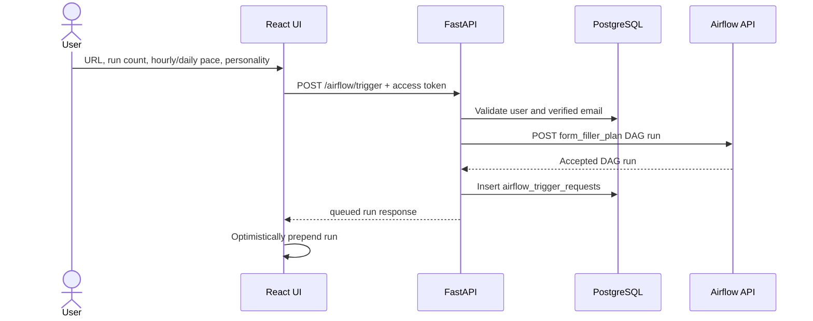
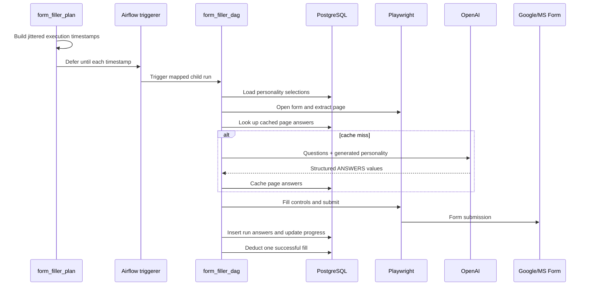

# Runtime flows

## Registration and email verification

1. React posts name, surname, email, and password to `POST /auth/register`.
2. The backend hashes the password with Argon2 and inserts `users`.
3. A `user_billing_info` row is created with an initial fill allowance.
4. The backend returns JWT access and refresh tokens.
5. The frontend may request `POST /auth/verify-email/send`.
6. The backend stores a random verification token and expiry, then sends an
   SMTP email containing `EMAIL_VERIFY_URL?token=...`.
7. `POST /auth/verify-email` marks the user verified.
8. Verified email is required to trigger a form run.

## Password or Google login

Password login verifies an Argon2 hash and returns an access/refresh pair.
Google login stores an OAuth state in the signed Starlette session, exchanges
the callback code with Google, creates or updates the user, and redirects to
the frontend with short-lived HTTP-only token cookies. The OAuth success page
exchanges those cookies through `GET /auth/tokens`; the API client then keeps
tokens in browser session storage and navigates directly to `/home`. The
private-route guard waits for `/auth/me` before rendering or redirecting.

## Form-run trigger

The backend appends the user UUID to a supplied run id. Overlong identifiers
are truncated and suffixed with a SHA-1 fragment to fit 255 characters.

## Scheduled execution

The first planned execution is scheduled approximately two minutes ahead.
The UI converts the selected hourly or daily pace into a base interval. Later
executions add scheduler-controlled jitter; users do not configure it directly.

## Run status

`GET /airflow/runs` joins application trigger records with `airflow_progress`
in application code. State is derived as:

1. `cancelled` when the trigger record was cancelled.
2. `failed` when any child recorded failure.
3. `success` when successful runs reach the expected total.
4. `running` after at least one success but before the total.
5. `queued` when no progress row or success exists.

The frontend fetches this list on mount and computes dashboard statistics. It
does not currently poll automatically after the initial fetch.

## Cancellation

1. The backend verifies the trigger record belongs to the caller.
2. It patches the parent Airflow run state to `failed`.
3. For `form_filler_plan`, it queries Airflow's `dag_run` table for child ids
   matching `<parent>__item_%` and patches each child concurrently.
4. It marks the application trigger record `cancelled`.

Cancellation is therefore represented differently in the two systems:
`failed` inside Airflow and `cancelled` in the Former application table.

## Billing and payment

- Successful child runs decrement `form_fills_remaining` and increment
  `form_fills_used`.
- The UI prevents submission when its locally fetched balance is insufficient.
- Stripe payment intents use EUR cents and include user/fill metadata.
- Payment confirmation retrieves the intent from Stripe, records an idempotent
  `stripe_transactions` row, and credits the purchased fills.

The backend trigger endpoint does not currently reserve or validate the full
requested quota before scheduling; see [Risks and roadmap](risks-and-roadmap.md).
